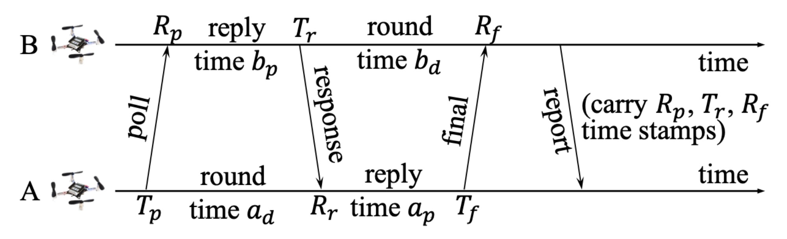

 [English](./README.md) | 中文

## Ultra-Wideband Swarm Ranging

**Ultra-Wideband Swarm Ranging**. [Feng Shan](http://twinhorse.net/), Jiaxin Zeng, Zengbao Li, [Junzhou Luo](https://cse.seu.edu.cn/2019/0102/c23024a257045/page.htm), [Weiwei Wu](https://cse.seu.edu.cn/2019/0103/c23024a257230/page.htm). *INFOCOM 2021*. [PDF](http://twinhorse.net/papers/SZLLW-INFOCOM21p.pdf), 是为高密集、高动态的集群所设计的超宽频测距协议，本仓库中包含了其所有源码。

> 本仓库基于 Bitcraze 提供的 Crazyflie 无人机 [官方版本固件](https://github.com/bitcraze/crazyflie-firmware) 二次开发，源代码主要位于 `crazyflie-firmware/src/deck/drivers/src/swarming` 文件夹。

如果认为我们的研究对您的工作有帮助的话，请参考下方的 Bibtex 友好地引用我们：
```
@article{shan2021ultra,
  title={Ultra-Wideband Swarm Ranging},
  author={Shan, Feng and Zeng, Jiaxin and Li, Zengbao and Luo, Junzhou and Wu, Weiwei},
  booktitle={IEEE INFOCOM 2021-IEEE Conference on Computer Communications},
  year={2021},
  organization={IEEE}
}
```



## 编译

克隆本仓库到本地

```
git clone --recursive https://github.com/SEU-NetSI/crazyflie-firmware.git
```

切换当前工作目录至`swarming`文件夹

```
cd crazyflie-firmware/src/deck/drivers/src/swarming
```

编译固件

```
make clean
make
```

烧录固件

```
cfloader flash path/to/cf2.bin stm32-fw
```

如果您有任何问题，请在仓库内发起 Issue 或通过 [邮件](mailto:shanfeng@seu.edu.cn) 联系我们。


